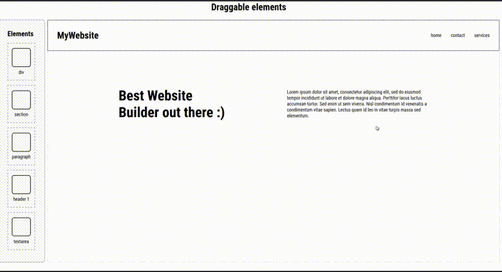
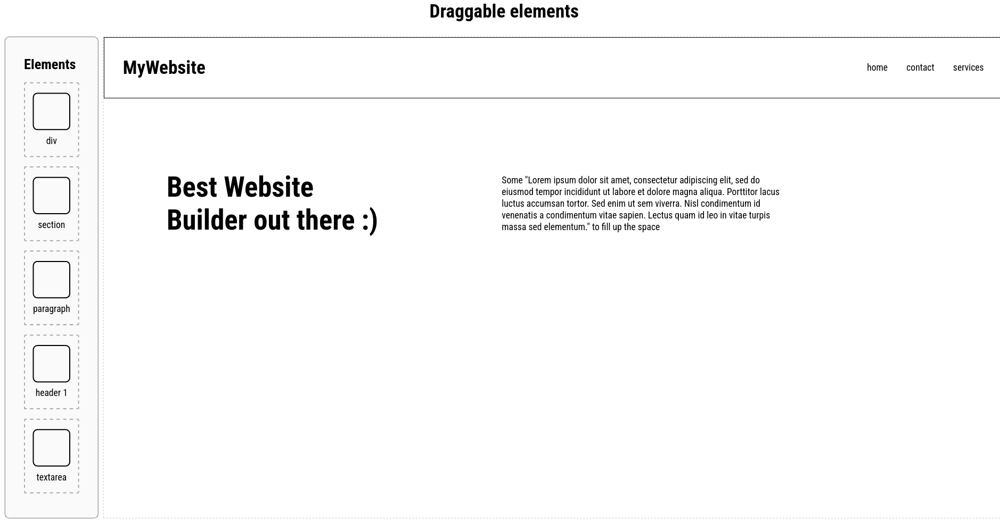
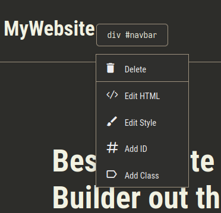

# Website Builder
A simple website builder using vanilla html, css and php.

## Usage
You'll need php installed.

1. Clone the repo:
```bash
git clone https://github.com/i3elj/website-builder && cd website-builder
```

3. Change permissions
```bash
chmod u+x run.sh
```

4. run it
```bash
./run.sh
```

5. If you're on windows you may want to run this command instead (optional)
```bash
php -S localhost:8080
```

## Demo
Little gif showing the demo


## Screenshots

